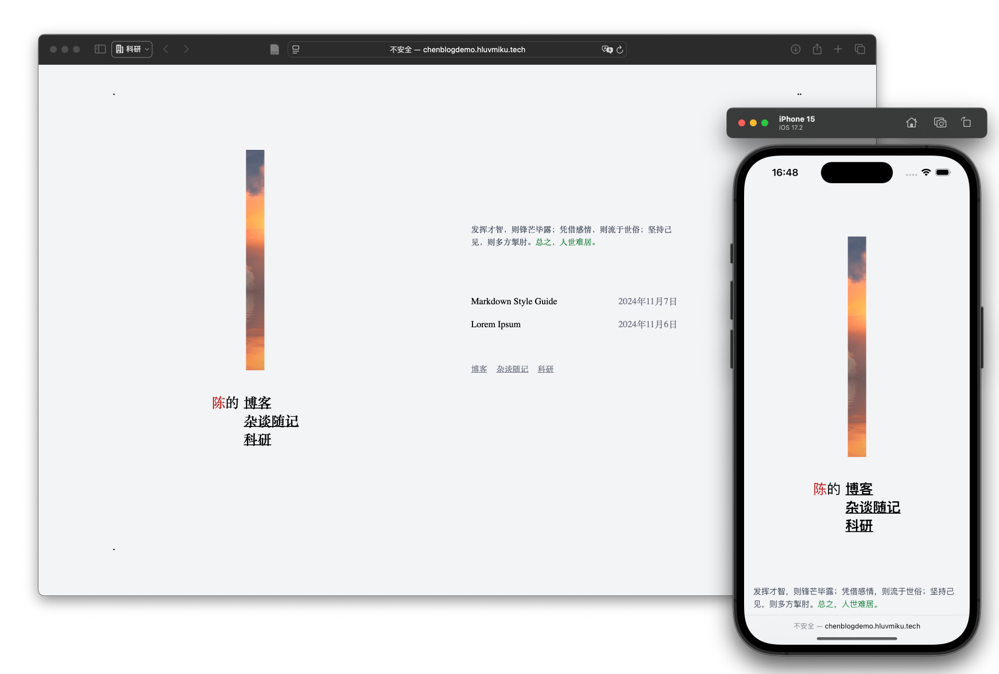

# 陈的博客

**陈的博客** 是一个用 [Astro](https://astro.build/) and [Tailwind CSS](https://tailwindcss.com/) 搭建的极简博客，广泛参考了[miniblog](!https://miniblog.nicholasly.com).



[在线Demo](http://chenblogdemo.hluvmiku.tech)

## 特点

- 支持 [Markdown](https://www.markdownguide.org/) 与 [MDX](https://mdxjs.com/)
- 使用 [Shiki](https://github.com/shikijs/shiki) 实现代码高亮
- [RSS](https://en.wikipedia.org/wiki/RSS) 与站点地图支持
- SEO 优化

## 开始

1. Click "Use this template", the big green button on the top right, to create a new repository with this template.

2. Clone the repository:

```bash
git clone https://github.com/[YOUR_USERNAME]/[YOUR_REPO_NAME].git
cd [YOUR_REPO_NAME]
```

3. Install dependencies:

```bash
npm install
```

4. Start the development server:

```bash
npm run dev
```

5. Optionally, format your code after making changes:

```bash
npm run format
```

### 站点配置

编辑 `src/consts.ts` 来更新个人信息与站点信息:

```ts
export const SITE_URL = "https://chenblogdemo.hluvmiku.tech";
export const SITE_TITLE = "陈的博客";
export const SITE_DESCRIPTION =
  "陈的博客 - 这里有我的个人见解、学习笔记和生活感悟。";

export const EMAIL = "mail@hluvmiku.tech";
export const POSTS_PER_PAGE = 15;
```

### 发博客

在 `src/content/posts/` 中添加` MarkDown` 或者 `MDX`.

```yml
---
title: "Lorem Ipsum"
description: "Lorem ipsum dolor sit amet."
date: "Nov 06 2024"
---
```

## License

This project is open source and available under the [MIT License](LICENSE).
